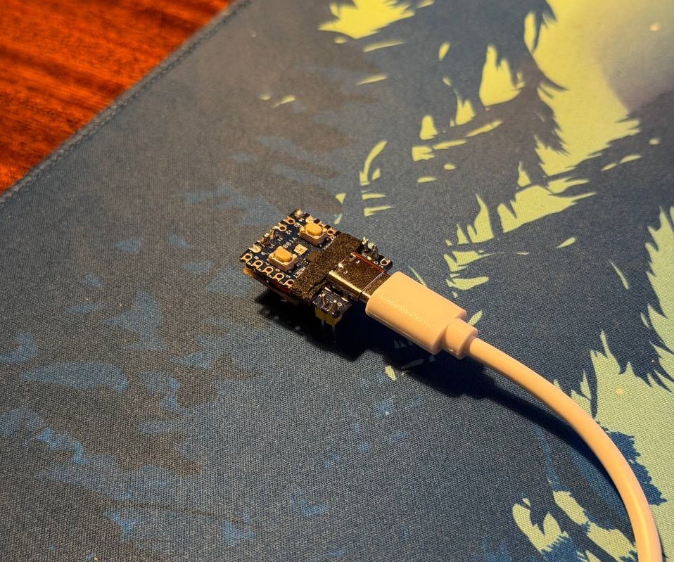
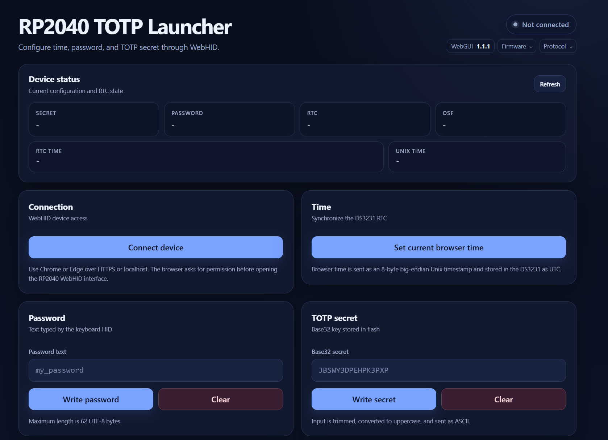

# RP2040 TOTP HID



RP2040 TOTP HID - это USB HID клавиатура на базе RP2040 для ввода TOTP кодов и сохраненного пароля.

Устройство работает как обычная USB клавиатура. Одинарное нажатие BOOTSEL вводит текущий TOTP код и нажимает Enter. Двойное нажатие BOOTSEL вводит сохраненный пароль и нажимает Enter.

Время хранится в RTC DS3231. TOTP секрет и пароль сохраняются во flash памяти RP2040. Настройка выполняется через WebHID страницу из браузера.



Через WebHID панель можно подключиться к устройству, установить время RTC из браузера, записать TOTP Base32 секрет, записать пароль и проверить состояние устройства.

## Возможности

- Ввод TOTP кода как USB HID клавиатура
- Ввод сохраненного пароля как USB HID клавиатура
- Одинарное нажатие BOOTSEL для TOTP кода
- Двойное нажатие BOOTSEL для пароля
- WebHID панель для настройки из браузера
- Установка времени RTC из браузера
- Запись и очистка TOTP Base32 секрета
- Запись и очистка пароля
- Чтение статуса устройства
- RTC DS3231 по I2C
- UART0 для отладки и ручной установки времени
- Хранение настроек во flash памяти
- CRC проверка сохраненной конфигурации
- Встроенная реализация Base32, SHA-1, HMAC-SHA1, HOTP и TOTP
- CMake preset для Waveshare RP2040-Zero

## Аппаратная часть

Пины по умолчанию:

| Назначение | Пин |
|---|---|
| DS3231 SDA | GP10 |
| DS3231 SCL | GP11 |
| UART0 TX debug | GP16 |
| UART0 RX debug | GP17 |
| Кнопка | BOOTSEL |
| USB | Нативный USB RP2040 |

Подключение DS3231:

| DS3231 | RP2040 |
|---|---|
| VCC | 3V3 |
| GND | GND |
| SDA | GP10 |
| SCL | GP11 |

UART отладка необязательна. Если она нужна, подключите USB-UART адаптер:

| USB-UART адаптер | RP2040 |
|---|---|
| RX | GP16 |
| TX | GP17 |
| GND | GND |

Параметры UART:

```text
115200 8N1
```

## Безопасность

Проект работает как клавиатура. Все, что вводит устройство, попадет в активное окно или активное поле ввода на компьютере.

Ограничения:

- TOTP секрет хранится во flash памяти RP2040 в открытом виде.
- Пароль хранится во flash памяти RP2040 в открытом виде.
- Человек с физическим доступом к устройству потенциально может извлечь сохраненные данные.
- Не подключайте устройство к недоверенным компьютерам.
- Не используйте устройство как единственную копию TOTP секрета.
- Перед нажатием BOOTSEL проверяйте, какое окно сейчас активно.
- Для предсказуемого ввода символов используйте US keyboard layout на хосте.
- Текущая прошивка поддерживает ограниченный набор ASCII символов для ввода пароля.

Это экспериментальный проект, а не сертифицированный security token.

## Сборка

### Требования

Нужно установить:

- git
- cmake
- make
- ARM embedded GCC toolchain, например arm-none-eabi-gcc
- зависимости Raspberry Pi Pico SDK

Клонирование с submodules:

```sh
git clone --recurse-submodules https://github.com/karen07/rp2040-totp-hid.git
cd rp2040-totp-hid
```

Если репозиторий уже был склонирован без submodules:

```sh
git submodule update --init --recursive
```

Сборка release прошивки:

```sh
cmake --preset release
cmake --build --preset release
```

UF2 файл будет создан здесь:

```text
build/release/rp2040_totp_hid.uf2
```

Preset по умолчанию использует:

```text
PICO_BOARD=waveshare_rp2040_zero
PICO_SDK_PATH=pico-sdk
CMAKE_BUILD_TYPE=Release
```

## Прошивка

Переведите RP2040 плату в USB bootloader mode:

1. Зажмите BOOTSEL.
1. Подключите плату по USB.
1. Отпустите BOOTSEL.
1. Скопируйте UF2 файл на появившийся диск RPI-RP2.

Пример:

```sh
cp build/release/rp2040_totp_hid.uf2 /media/$USER/RPI-RP2/
```

Можно также просто скопировать UF2 файл на диск RPI-RP2 через файловый менеджер.

После прошивки плата перезагрузится и появится как USB HID устройство.

## Настройка через WebHID

В репозитории есть файл:

```text
rp2040-webhid-launcher.html
```

Обычно можно сначала просто открыть этот файл напрямую в Chrome или Edge.

Порядок настройки:

1. Откройте rp2040-webhid-launcher.html в Chrome или Edge.
1. Нажмите кнопку подключения к устройству.
1. Выберите RP2040 TOTP HID в списке устройств.
1. Установите время RTC из браузера.
1. Запишите TOTP Base32 секрет.
1. При необходимости запишите пароль.
1. Обновите статус и проверьте состояние RTC и OSF.

Если браузер не разрешает доступ к WebHID при открытии HTML файла напрямую, запустите локальный HTTP сервер:

```sh
python3 -m http.server 8000
```

Затем откройте:

```text
http://localhost:8000/rp2040-webhid-launcher.html
```

WebHID обычно работает в Chrome или Edge. Если подключение не появляется, проверьте, что страница открыта через localhost или HTTPS.

Браузер отправляет Unix time. Прошивка записывает это время в DS3231 как UTC.

## Настройка через UART

UART0 можно использовать для отладочного вывода и ручной установки времени.

Поддерживаемые команды:

```text
TIME YYYY-MM-DD HH:MM:SS
EPOCH <seconds>
```

Примеры:

```text
TIME 2026-07-02 12:00:00
EPOCH 1782993600
```

Время интерпретируется как UTC.

## Использование

После настройки устройство работает так:

- Одинарное нажатие BOOTSEL:

  - читает текущее время из DS3231
  - генерирует 6-значный TOTP код
  - вводит код как USB HID клавиатура
  - нажимает Enter

- Двойное нажатие BOOTSEL:

  - вводит сохраненный пароль как USB HID клавиатура
  - нажимает Enter

Перед нажатием BOOTSEL убедитесь, что нужное поле ввода находится в фокусе.

## Параметры TOTP

Значения по умолчанию:

| Параметр | Значение |
|---|---|
| Алгоритм | HMAC-SHA1 |
| Количество цифр | 6 |
| Шаг времени | 30 секунд |
| Формат секрета | Base32 |

WebHID страница принимает Base32 секрет. Пробелы игнорируются. Строчные буквы автоматически приводятся к верхнему регистру.

## Ограничения ввода пароля

Прошивка вручную отображает символы в USB HID keycodes.

Сейчас поддерживаются:

```text
a-z
A-Z
0-9
space
newline
tab
= + - _ . , / \
```

Остальные символы текущая реализация игнорирует.

Для корректного ввода символов используйте US keyboard layout на хосте.

## Структура проекта

```text
.
|-- CMakeLists.txt
|-- CMakePresets.json
|-- LICENSE
|-- README.md
|-- device.png
|-- example.png
|-- include
|   |-- tusb_config.h
|   `-- usb_descriptors.h
|-- pico-sdk
|-- pico_sdk_import.cmake
|-- rp2040-webhid-launcher.html
`-- src
    |-- main.c
    `-- usb_descriptors.c
```

Основные файлы:

- src/main.c - основная логика прошивки: RTC, TOTP, flash конфигурация, обработка BOOTSEL, UART, HID ввод и WebHID команды.
- src/usb_descriptors.c - USB descriptors для HID клавиатуры и vendor-defined HID report.
- include/tusb_config.h - конфигурация TinyUSB device stack.
- include/usb_descriptors.h - report IDs и размер vendor report.
- rp2040-webhid-launcher.html - WebHID панель настройки.
- CMakePresets.json - release preset для Waveshare RP2040-Zero.

## Другая плата или другой pinout

Preset по умолчанию использует:

```text
PICO_BOARD=waveshare_rp2040_zero
```

Для сборки под другую плату можно изменить CMakePresets.json или сконфигурировать проект вручную:

```sh
cmake -S . -B build \
  -DPICO_SDK_PATH=pico-sdk \
  -DPICO_BOARD=pico \
  -DCMAKE_BUILD_TYPE=Release

cmake --build build
```

Пины сейчас заданы в src/main.c:

```c
#define RTC_SDA_GPIO 10
#define RTC_SCL_GPIO 11

#define DBG_UART_TX 16
#define DBG_UART_RX 17
```

Измените эти значения, если у вас другая разводка.

## Troubleshooting

### Устройство не появляется в WebHID

Проверьте, что:

- прошивка залита на плату
- плата подключена по USB
- страница открыта в Chrome или Edge
- страница открыта напрямую, через localhost или через HTTPS
- устройство не занято другой вкладкой браузера
- устройство видно в системе как USB HID устройство

Если прямое открытие HTML файла не работает, запустите страницу через localhost:

```sh
python3 -m http.server 8000
```

И откройте:

```text
http://localhost:8000/rp2040-webhid-launcher.html
```

### TOTP код неправильный

Проверьте, что:

- время в DS3231 установлено правильно
- время из браузера успешно записалось через WebHID
- в DS3231 установлена backup battery
- OSF status не установлен
- Base32 секрет введен правильно
- сервис использует 6 цифр, 30 секунд и HMAC-SHA1

### Пароль вводится неправильными символами

Используйте US keyboard layout на хосте. USB HID keycodes зависят от раскладки клавиатуры для символов.

### Пароль вводится не полностью

Текущая прошивка поддерживает не все символы. Неподдерживаемые символы игнорируются.

Поддерживаемый набор:

```text
a-z
A-Z
0-9
space
newline
tab
= + - _ . , / \
```

### Сборка падает из-за отсутствующего Pico SDK

Инициализируйте submodules:

```sh
git submodule update --init --recursive
```

Затем пересоберите:

```sh
cmake --preset release
cmake --build --preset release
```

### Сборка падает из-за неподходящей платы

Проверьте значение PICO_BOARD в CMakePresets.json.

По умолчанию используется:

```text
waveshare_rp2040_zero
```

Если у вас другая плата, измените PICO_BOARD или соберите вручную с нужным значением.

## Лицензия

Проект распространяется под лицензией GNU Affero General Public License v3.0. Подробности смотрите в файле LICENSE.
